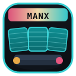
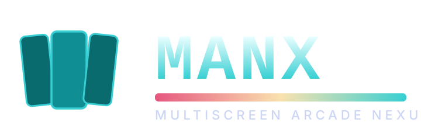

#  MANX — Multiscreen Arcade Nexus

[](LICENSE)
[]()
[]()

**MANX** is the rebrand of the MANX project. It is a focused standalone
multi-board arcade emulator for Windows and Linux. Its 46 working sets span
Namco System 22 / Super System 22, System 246, Model 1, Model 2, Namco
System 1, Galaga, Galaxian, Phoenix, Sega System 16B, Taito Z System,
Ghosts'n Goblins hardware and the Xbox 360.

**Multi-screen. Multi-player. Networked arcade cohesion.**

MAME's BSD hardware implementations are the primary behaviour reference;
machine integration, scheduling, frontend, storage and host output are
standalone.



## Why the rebrand

The original name was MANX. MANX keeps the codebase, the working
sets and the existing plug-in host, and gives the project a name that puts
its distinguishing feature — **multiscreen cabinet support** — at the
front. The Multiscreen Arcade Nexus is the goal: one launcher that knows
about cabinet form, screen count and link topology, and shows games
through that lens instead of a flat list.

## Multiscreen first

Every working set in MANX has been tagged with the cabinet form it actually
needs:

- **Single-screen uprights** — Galaga, Galaga '88, Galaxian, War of the
  Bugs, Phoenix, Pac-Mania, Shinobi twin-stick, Bay Route, Cyber Police
  E-SWAT, Wonder Boy III: Monster Lair, Ghosts'n Goblins, and the 2D
  classics.
- **Sit-down / single-cockpit** — Continental Circus, Ridge Racer, Virtua Formula, Star Wars
  Arcade, Time Crisis (gun), Dirt Dash World DT2, System 22 / Super
  System 22 main boards.
- **Multi-cabinet / linked** — Galaga twin-cockpit, Shinobi twin-cockpit,
  the System 22 / Super System 22 link fabric and the Model 2 link board.
- **Multi-monitor wall** — System 246 boards driven as a 3-column wall,
  and Burnout 3 / Geometry Wars as native plugins that take the same
  launcher shim.

The launcher makes these groups visible through the game browser and an
animated, icon-led launch screen. A game can expose solo, local multiplayer,
split-screen, linked-cabinet and network modes without changing its title.
Linked games then show the cabinet count and display layout graphically;
Daytona USA and Manx TT can launch rings of up to eight local instances.

Private MAME media packs can be attached from **Settings → ROM, CHD and
private media folders**. Point the source browser at a mounted `media`
directory (our NAS is `/Roms/v3_0.285/media`), then choose **Import/update
media for installed games**. MANX mirrors the source folder structure into
its per-user media directory but copies only files matching installed ROM
short names, including per-game directories. It recognises titles, snaps,
covers, flyers, cabinets, marquees and icons for the launcher. The NAS path
stays in local settings and no private media ships with MANX. For a temporary
source, set `MANX_MEDIA_ROOT` to the mounted media directory.

## Network play

Open MANX on two or more computers on the same network and they find each
other automatically - no IP address to type, no host and client to decide in
advance, no port to forward, and no firewall rule to add. Choose **Network
Play** on each, ask a machine (or **Ask Everyone**), and the machines that
accept start the same game together. Only games installed on every machine
taking part are offered.

- **Arcade System Link** wires up to eight cabinets through the link
  hardware their boards actually used.
- **Take Turns** and **Play Together** are MANX's own lockstep netplay for
  two machines sharing one emulated board.

The lobby also relays each machine's console output to the others, so you
can read a remote cabinet's log from here, and offers **Do Not Disturb** to
refuse invitations. See [docs/netplay.md](docs/netplay.md) for the full
flow, how discovery works through desktop firewalls, and what to check when
two machines do not meet. `tools/setup-machine.sh` (Linux) and
`tools/setup-machine.ps1` (Windows) set up a machine for pushing builds and
reading logs over SSH.

## Current status

Implemented and tested (most relevant items; full list in `docs/`):

- Motorola MC68020 execution through the standalone Musashi 4.60 core
- Big-endian System 22 and Super System 22 main memory maps
- System 22 interrupt controller and game-programmable vblank IRQ delivery
- Directory and ZIP ROM loading with MAME sizes and CRC-32 validation
- Per-game program interleave, ROM-region placement and CRC validation
- Two real TMS320C25-derived C71 cores with master/slave program and
  polygon-RAM maps
- 32-voice C352 mixing with C74-to-C352 register traffic
- OpenGL 4.3 renderer with thread-safe polygon producer/consumer boundary
- C71 direct-render command decoding and hardware triangle rendering
- Ridge Racer's linked PDP command stream, point-ROM/point-RAM object lists
  and live palette RAM
- Super System 22 C374/VICS sprite-list decoding
- Time Crisis gun coordinates, cabinet trigger/pedal, mouse aiming and
  per-player crosshairs
- Hot-pluggable SDL / Xbox and keyboard controls with per-device launcher
  mapping and calibrated axes
- System 24 RAM tile pages, character decoding and 3D composition for
  Model 1 (Virtua Formula, Virtua Fighter, Star Wars Arcade, Wing War)
- Sega System 16B ROM boards 171-5358, 171-5521, 171-5704 and 171-5797,
  the last adding the 315-5248 multiplier, two 315-5250 compare/timers
  and a single 512 KiB program window for Cyber Police E-SWAT
- Namco System 1 (3x MC6809E + HD63701 MCU behind the CUS117 MMU) running
  both Pac-Mania and Galaga '88, which differ only in their ROM set and
  CUS153 keycus id
- Taito Z System (two MC68000s sharing work RAM) with the TC0100SCN
  tilemap generator, TC0150ROD road generator, TC0110PCR palette and
  TC0040IOC input chip, running Continental Circus, plus its sound board:
  a Z80 driving a YM2610 (FM + SSG + ADPCM-A and ADPCM-B sample playback)
  through a TC0140SYT mailbox.

- System 246 main board path with PCSX2 reimplementation in progress
  (`system246-pcsx2-rewrite` branch)
- Geometry Wars 1, 2 and 3, Sonic 4 Episode I, SoulCalibur and Hydro Thunder
  recomp products as plugins hosted by the same launcher shim; the Geometry
  Wars titles have title-validated MANX Online leaderboard submissions

## ROM requirements

You must supply any ROMs yourself, and only ones you are legally entitled
to use. There is no FD1094, FD1089 or MC-8123 decryptor here, so an
encrypted Sega set cannot be run directly. E-SWAT loads from MAME's
pre-decrypted `eswatd` clone and Wonder Boy III from `wb33d`; each takes
its two program chips from the clone and every graphics and sound chip
from the `eswat` / `wb3` parent, so a merged archive supplies both.
Wonder Boy III's own parent additionally needs an i8751 whose program was
never dumped, which is the other reason the decrypted clone is the usable
set.

## Building

### Linux

```bash
cmake -S . -B build-release -DCMAKE_BUILD_TYPE=Release
cmake --build build-release -j
```

See [LINUX_README.md](LINUX_README.md) for distro-specific dependencies
and packaging notes.

### Windows

See [WINDOWS_README.md](WINDOWS_README.md). MSVC + vcpkg + Vulkan SDK.

## Project layout

```
src/             emulator and runtime
include/         shared headers
docs/            architectural notes, board plans, marketing collateral
scripts/         build helpers
game_data/       runtime metadata
roms/            placeholder for the ROM set (not in git)
third_party/     upstream code (Musashi, moira, ...)
tests/           unit and integration tests
logo-*.svg       brand assets
manx.svg LEGACY — kept during the rebrand transition; do not use
CMakeLists.txt   project(MANX) — renamed in the next release
```

## License

GNU General Public License v3.0. See [LICENSE](LICENSE) for the full text
and [THIRD_PARTY_NOTICES.md](THIRD_PARTY_NOTICES.md) for upstream licenses.

## Brand

- Mark (square app icon): `logo-mark.svg`, also as `logo-512.png` /
  `logo-256.png` / `logo-128.png` / `logo-64.png`.
- Wordmark (banner): `logo-wordmark.svg` / `logo-wordmark.png`.
- Emblem (round badge): `logo-emblem.svg` / `logo-emblem-256.png`.

When linking back to the project, please use the mark and the wordmark
together; the emblem is for icon-only contexts.

## Contributing

See [docs/architecture.md](docs/architecture.md) for the emulator
internals and [docs/cross_platform_build_scope.md](docs/cross_platform_build_scope.md)
for the platform matrix.

## Migration notes

The rebrand is staged:

- **Phase 1 (this commit)**: marketing identity, logo, README, top-level
  docs, code-comment banners. Identifiers in source still say
  `MANX`. Build is `project(MANX)`.
- **Phase 2 (in progress)**: graphical play-mode, cabinet-count and display
  layout screens are implemented; identifier and project-name renaming remains.
- **Phase 3**: GitHub-side repo rename to `CrownParkComputing/MANX`,
  redirect from `MANX`, release tagging.
